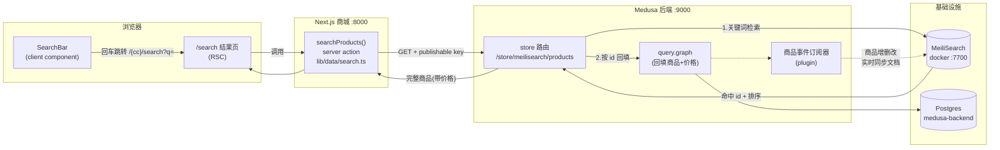
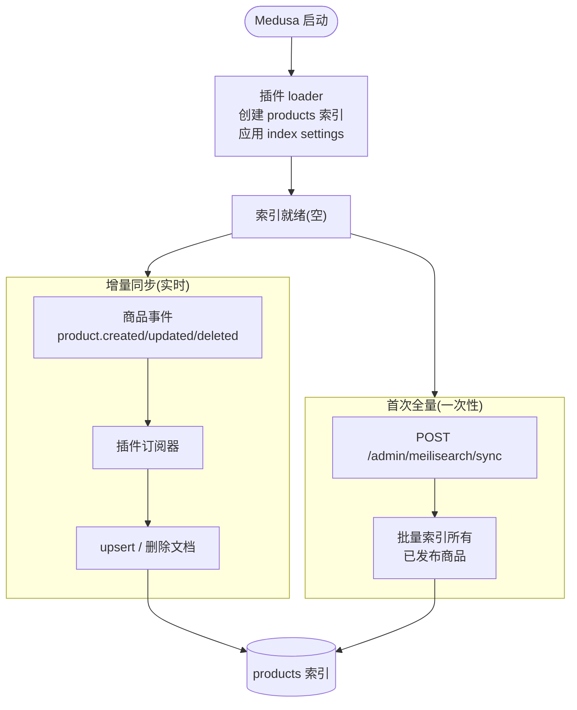
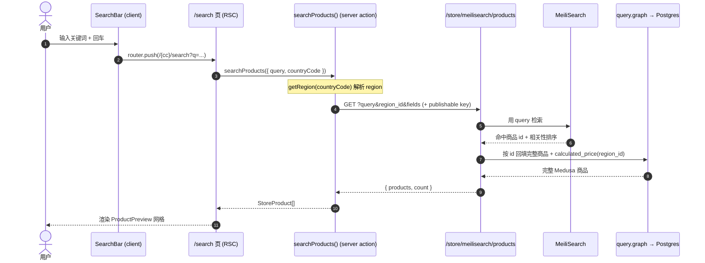
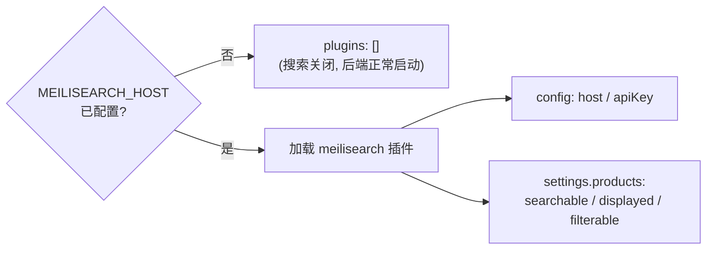
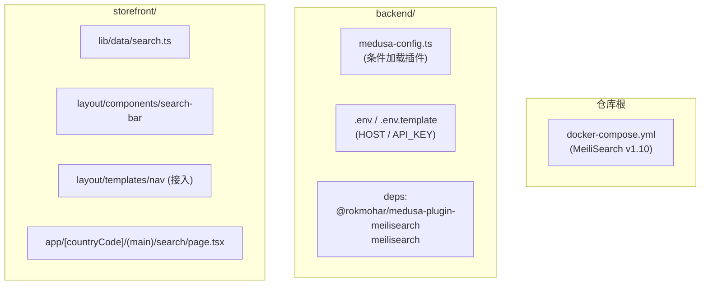

# 产品搜索技术架构文档

> 状态：已实现并本地端到端验证 — 2026-07-12
> 关联文档：[search-meilisearch.md](./search-meilisearch.md)（部署/运维手册）
> 适用范围：Medusa 2.x 后端 (`backend/`) + Next.js 15 商城 (`storefront/`) + MeiliSearch

商城的产品全文搜索由 **MeiliSearch** 提供检索能力，后端通过 `@rokmohar/medusa-plugin-meilisearch` 建索引并暴露 store 路由，前端以轻量 server action 调用。核心原则：**MeiliSearch 只负责"哪些商品匹配、如何排序"，真实商品数据与价格始终来自 Medusa/Postgres；浏览器绝不直连 MeiliSearch。**

---

## 1. 组件全景

三方职责分离：

| 组件 | 职责 |
|------|------|
| **MeiliSearch** | 倒排索引、拼写容错、相关性排序 → 返回命中的商品 **id + 顺序** |
| **Medusa 后端** | 建索引/同步（写侧）、暴露 store 路由、用 id 回填**真实商品数据 + region 价格**（读侧） |
| **Next.js 商城** | 搜索框交互、调用 server action、用现有 `ProductPreview` 渲染结果 |

---

## 2. 索引数据流（写侧：数据怎么进 MeiliSearch）

由后端插件全自动完成，前端无感知。

要点：
- **启动**：loader 创建 `products` 索引并按 `medusa-config.ts` 的配置应用 `searchableAttributes` / `displayedAttributes` / `filterableAttributes`。
- **增量**：订阅商品事件，商品一变即同步——无需手动。
- **首次全量**：订阅器只对新事件生效，已存在的老商品需 `POST /admin/meilisearch/sync` 灌一次。
- **只索引已发布商品**：draft 商品不进 store 搜索。
- **文档只存检索字段**（`id/title/description/handle/variant_sku/thumbnail`），**不存价格/库存**——留给读侧回填。

---

## 3. 查询数据流（读侧：一次搜索怎么走）

对应代码路径：

| 步骤 | 位置 |
|------|------|
| 搜索框 | `storefront/src/modules/layout/components/search-bar/index.tsx` |
| 结果页 | `storefront/src/app/[countryCode]/(main)/search/page.tsx` |
| server action | `storefront/src/lib/data/search.ts` |
| 后端路由 | 插件提供 `GET /store/meilisearch/products` |
| 回填 | 插件内部 `query.graph`（Medusa 核心） |

搜索 URL 约定：`http://localhost:8000/{countryCode}/search?q={关键词}`（如 `/us/search?q=nitrile`）。

---

## 4. 关键设计决策

- **浏览器不直连 MeiliSearch**：全程经 Medusa（携带 publishable key），MeiliSearch 密钥只留后端，前端零密钥暴露。
- **检索与数据解耦**：MeiliSearch 管排序、Medusa 管真实数据/价格/库存 → 搜索结果永远是最新价格，索引无需存/同步价格。
- **契合既有架构**：搜索是 `lib/data` 里的一个 server action，与 `listProducts` 同一模式；前端**零新增依赖**（未引入 instant-search / meili client）。
- **可条件降级**：`medusa-config.ts` 中 `MEILISEARCH_HOST` 为空时**不加载插件** → 测试环境/未装搜索引擎时后端照常启动，后端 Jest 套件保持 hermetic。
- **相关性开箱即用**：MeiliSearch 自带拼写容错 + 字段权重（实测 "latex" 时真乳胶手套排在模糊匹配之前）。

### 后端插件配置（`backend/medusa-config.ts`）

---

## 5. 组件与文件清单

| 层 | 文件 | 作用 |
|----|------|------|
| 基础设施 | `docker-compose.yml` | 本地 MeiliSearch 服务 |
| 后端 | `medusa-config.ts` | 条件加载插件、索引字段配置 |
| 后端 | `.env` / `.env.template` | `MEILISEARCH_HOST` / `MEILISEARCH_API_KEY` |
| 前端 | `lib/data/search.ts` | `searchProducts()` server action |
| 前端 | `modules/layout/components/search-bar/index.tsx` | 导航栏搜索框（client） |
| 前端 | `modules/layout/templates/nav/index.tsx` | 接入搜索框（替换原 disabled input） |
| 前端 | `app/[countryCode]/(main)/search/page.tsx` | 搜索结果页（RSC） |

---

## 6. 已知边界与可选增强

- **未发布商品不可搜**：draft 商品不进 store 索引（设计如此）。
- **`currency_code` 不是合法查询参数**：store 路由仅接受 `region_id` 驱动价格（前端已按此实现）。
- **列表内筛选未接**：商品列表页 `refinement-list/search-in-results` 仍为 disabled（"在当前结果内筛选"语义不同）。
- **可选增强**：类目索引做分面过滤（插件支持 `categories`）、或前端换 `react-instantsearch` 实现输入即搜 / facet UI、语义搜索（插件支持 `semanticSearch`）。
